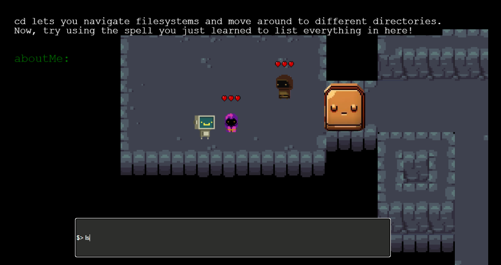

# Game Name

Bash the Dungeon

# Team Color

Red

# Developers

* Ryan Sanchez (ryansan@udel.edu)
* Christian Rullan Crespo (rullan@udel.edu)

# Blurb

Bash the Dungeon is a top-down adventure game where players explore a dungeon and learn bash commands as they meet friendly dungeon dwellers and defeat enemeies. With each enemy encounter, players put their bash skills to the test as they strategically use their 'spells.' Players utilize an in-game terminal to enter bash commands and navigate filesystems.

# Basic Instructions

Use arrow keys to move your player around and type commands using your keyboard.

# Screenshot

# Gameplay Video
TEXT GOES HERE

# Educational Game Design Document

Link to our [egdd](https://ud-s24-cisc374.github.io/final-project-red/docs/egdd.html)

# Credits
* Start Background - [YUCALORA on Shutterstock](https://www.shutterstock.com/image-vector/dark-dungeon-long-medieval-castle-corridor-2118070751)
* Hearts - [SwooshWhoosh on itch.io](https://swooshwhoosh.itch.io/heartsui)
* Battle Music - ["Retro Platforming" by David Fesliyan](https://www.fesliyanstudios.com/royalty-free-music/download/retro-platforming/454)
* Background Music - ["8 Bit Nostalgia" by David Fesliyan](https://www.fesliyanstudios.com/royalty-free-music/download/8-bit-nostalgia/2289)
